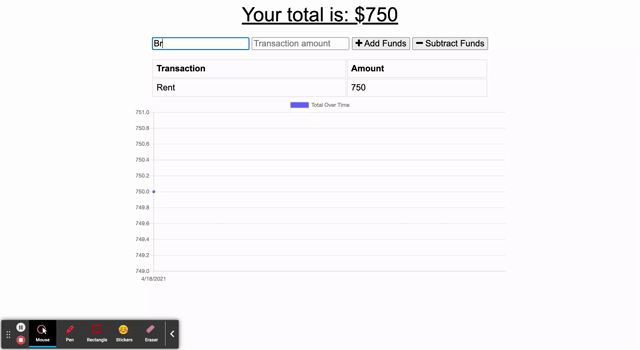

# Budget Tracker 

## Description

Giving users a fast and easy way to track their money is important, but allowing them to access that information at any time is even more important. Having offline functionality is paramount to the success of an application that handles users’ financial information.

I added service workers and indexeddb functionality to update an existing budget tracker application to allow for offline access and functionality. The user will be able to add expenses and deposits to their budget with or without a connection. If the user enters transactions offline, the total should be updated when they're brought back online.

## Usage 

Here is a demo of how this app works

## Aplication
You can visit the application [here](https://powerful-inlet-44007.herokuapp.com/)

## Credits 
Big thanks to the Upenn LPS Coding Bootcamp instructional team, and my tutor, Jon Jackson for all their support!

